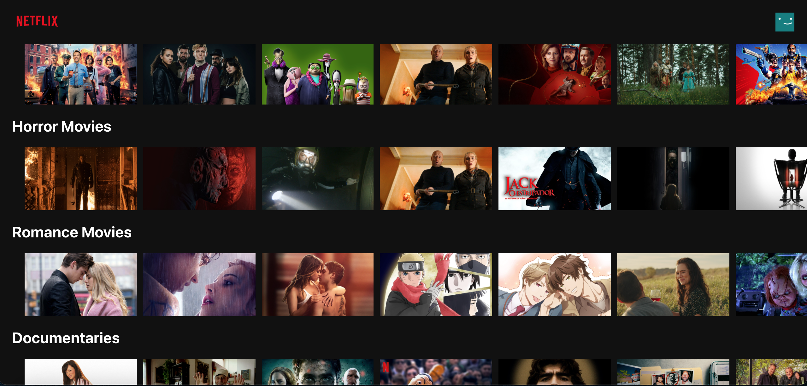

# NETFLIX-CLONE

# Description
In this project, I tackle the challenge of creating a clone of the Netflix Web Application. 
This Netflix clone was possible using the [TMDB API](https://www.themoviedb.org/?language=en-US), which provided
a movie posters, descriptions, top movies in varies genres, and more. 

Currently, A user is able to see the different movie names, descriptions, and posters. I am additional working on loading the trailer for each movie for the user to play as well. As of now, the movies are not interactive upon click.

# Preview

## Prequisites and Installation

To get started, make sure to do the following steps:
1. Run the following commands:
  - `npm install`
  - [TMDB API KEY](https://developers.themoviedb.org/3/getting-started) stored as environment variable under the name:      REACT_APP_TMDB_API_KEY
  - `npm run start`

# Technologies Used
- [React](https://reactjs.org/) 
- [Redux](https://react-redux.js.org/)
- HTML
- CSS
- Firebase (hosting)

# Features Coming Soon
- Add Trailers for the movies
- Authentication and Sign up
- Choosing a subscription plan & payment integration with Stripe (for learning purposes. No real payment plans will be sold)

Disclaimer: This app is for learning purposes and is not intended to sell or use any data for commercial use.